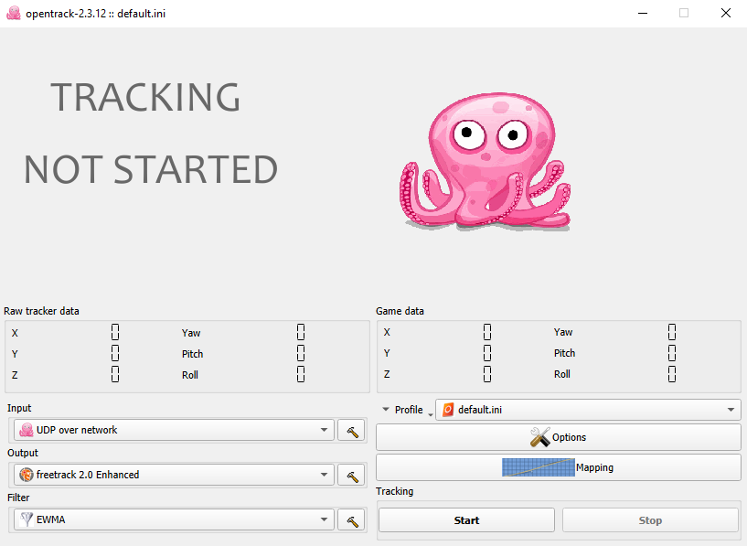

# FaceTrackWebcam
### Use um smartphone para capturar os movimetos da sua cabeça e transformar em inputs para seu jogo.

 

*Disclaimer: esse pode não ser o melhor método para capturar movimentos através de uma webcam, porém é o método que melhor funcionou par mim.*

## Programas necessários :link:
- Opentrack ( https://github.com/opentrack/opentrack/releases )
- AiTrack ( https://github.com/AIRLegend/aitrack/releases )
- DroidCam

 

:diamonds: O OpenTrack já vem com um tracker que usa o smartphone e reconhece os movimentos automaticamente chamado **FreePIE**, a apk para sua instalação está no diretório raiz do Opentrack no seu PC. Se o seu celular for compatível com o FreePIE o **AiTrack** e o **DroidCam** não são necessários.  
:diamonds: Caso queira usar uma webcam ao invés do celular, a etapa de conexão do celular com o computador feita pelo **DroidCam** não é necessária.

  

## Configuração :gear:

### Opentrack:
O opentrack recebe dados de equipamentos ou softwares que capturam seus movimentos e os convertem em comandos que podem ser lidos pelo seu jogo.

:black_medium_square: **INPUT: Método de entrada dos dados para o programa**  
Selecione **UDP Over network** que é o método usado para receber as informações do AiTrack

### DroidCam:
Abra o app no seu smartphone e selecione as configurações desejadas ( dê prioridade a quantidade de quadros por segundo para melhor leitura do software de reconhecimento facial )
